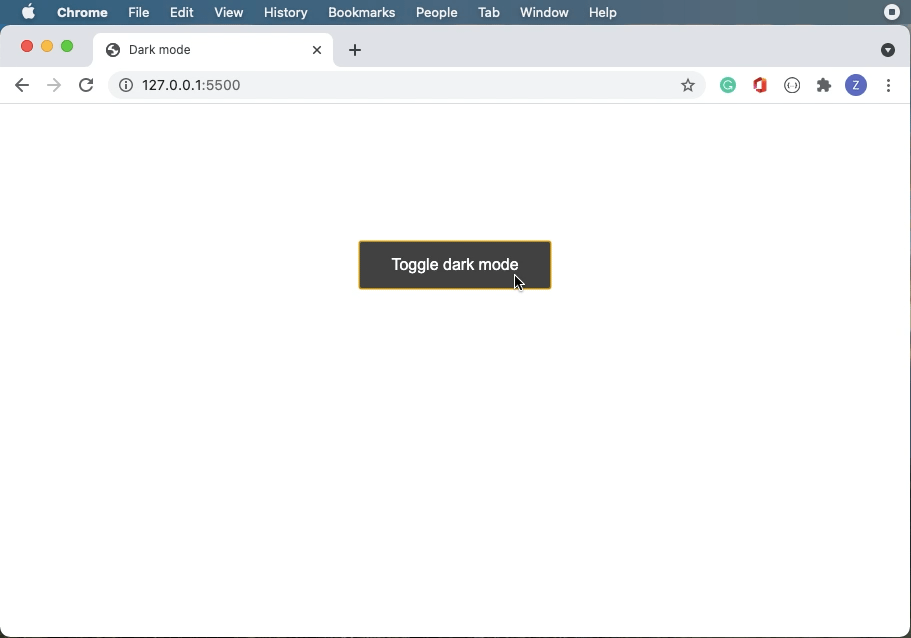

# dark-mode-toggle

Dark mode `toggle made in javascript` using local storage made with vanilla Js.

## Preview

Link: http://zaidajani.github.io/dark-mode-toggle/

Its simple to use.

## Enjoy your powerful application
